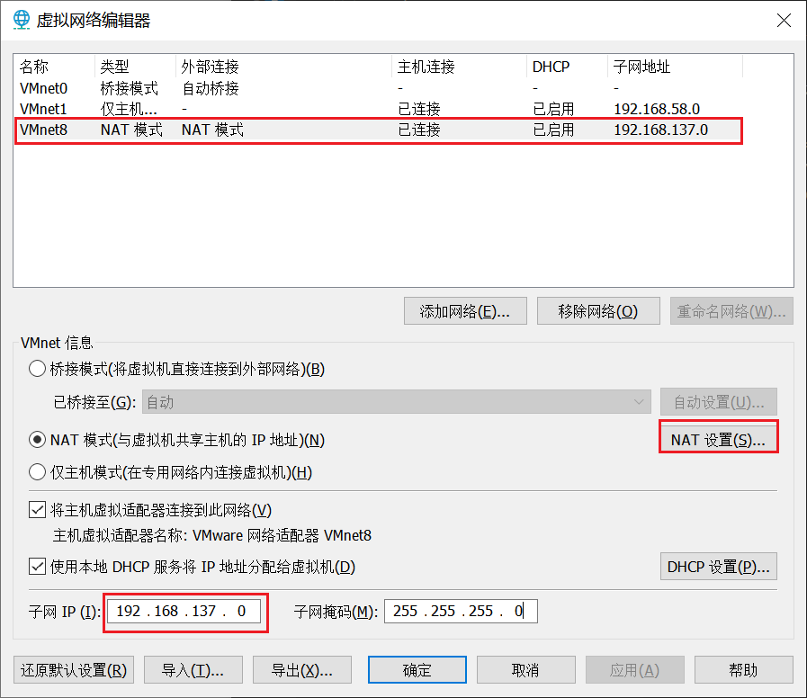
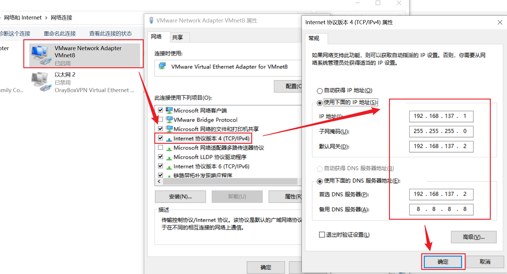

### 1.虚拟机网络编辑器

配置网段为：192.168.137.0
NAT设置中将网关设置为：192.168.137.2
### 2.windows网络适配器

如图配置
### 3.虚拟机系统配置
#### 3.1 固定虚拟IP
启动虚拟机中的centos，将其IP固定化，避免每次重启IP变更。
```
# vim /etc/sysconfig/network-scripts/ifcfg-ens33
```
配置如下：
```
#IP地址
IPADDR=192.168.137.100
#网关
GATEWAY=192.168.137.2
#dns
DNS1=192.168.137.2
```
#### 3.2 修改主机名
```
vim /etc/hostname
```
配置为：
```
centos100
```
#### 3.3配置host
```
vim /etc/hosts
```
配置为：
```
127.0.0.1   localhost localhost.localdomain localhost4 localhost4.localdomain4
::1         localhost localhost.localdomain localhost6 localhost6.localdomain6
192.168.137.100 centos100
192.168.137.101 centos101
192.168.137.102 centos102
192.168.137.103 centos103

```